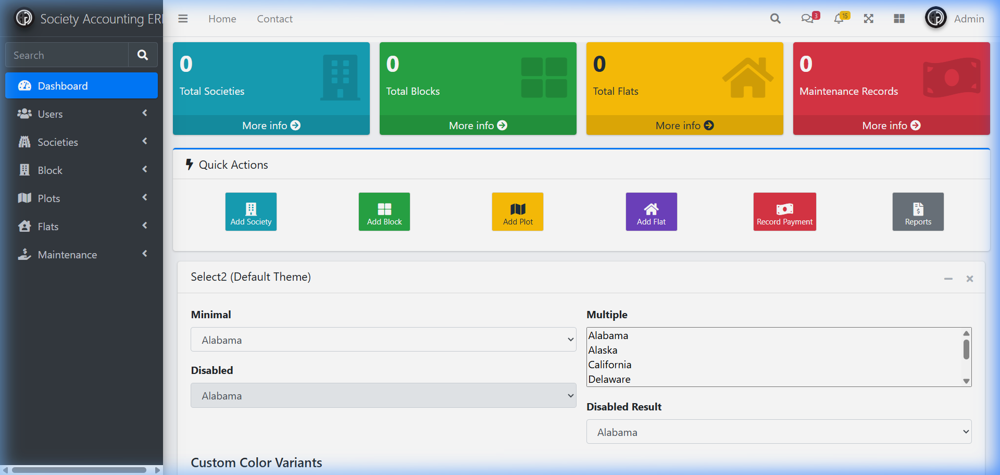
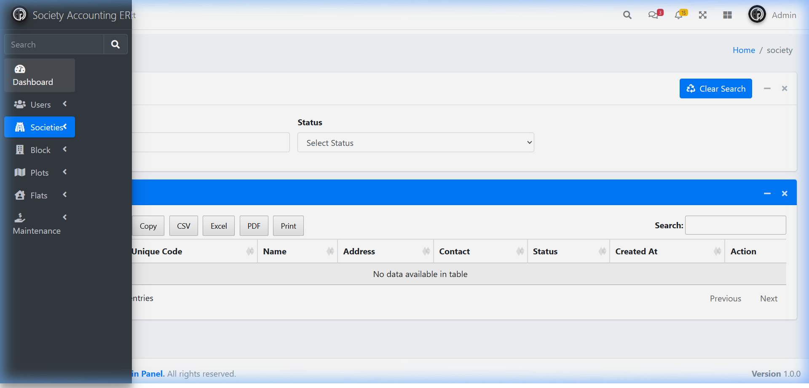
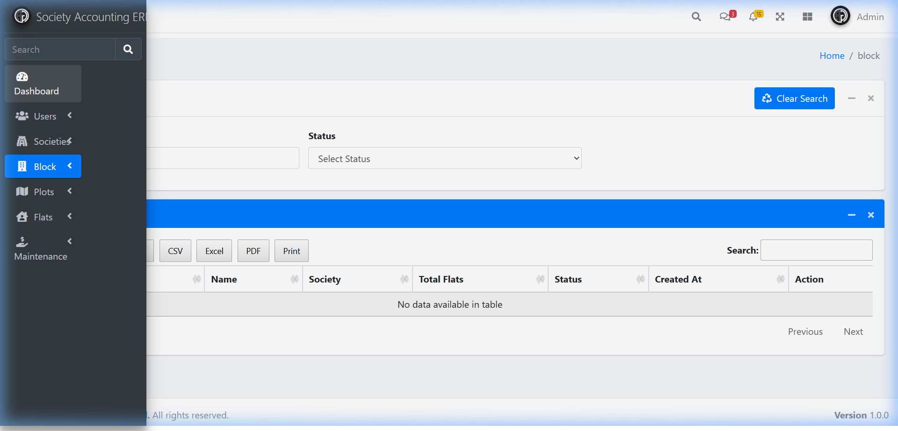
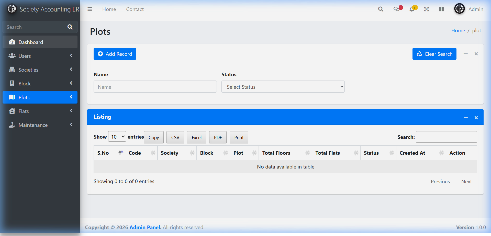
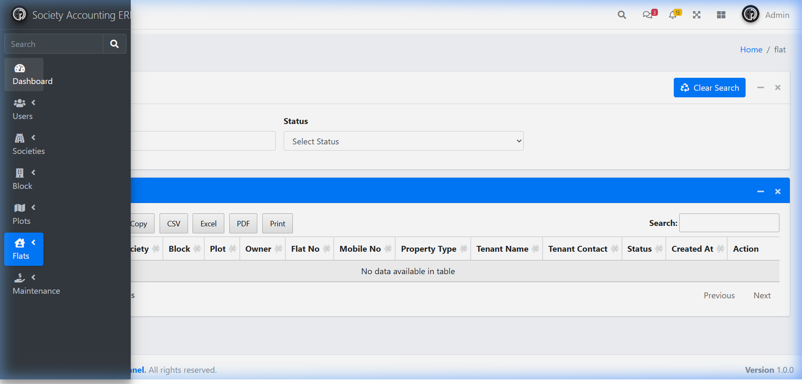
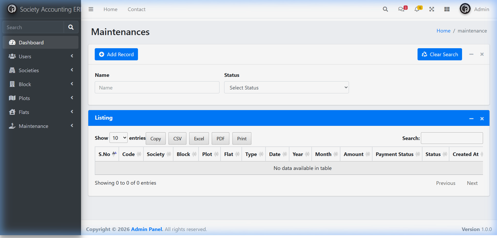
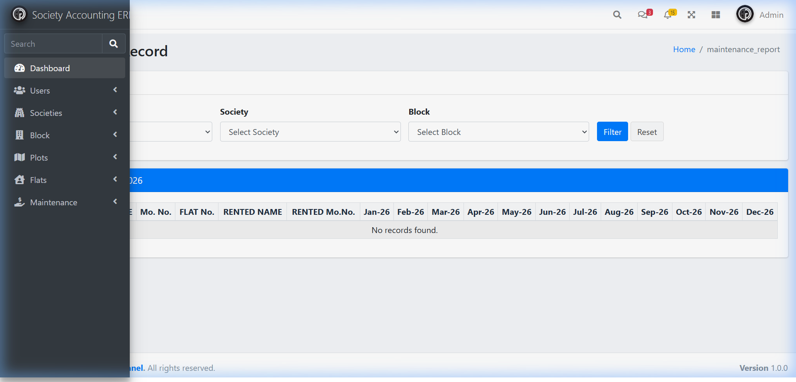
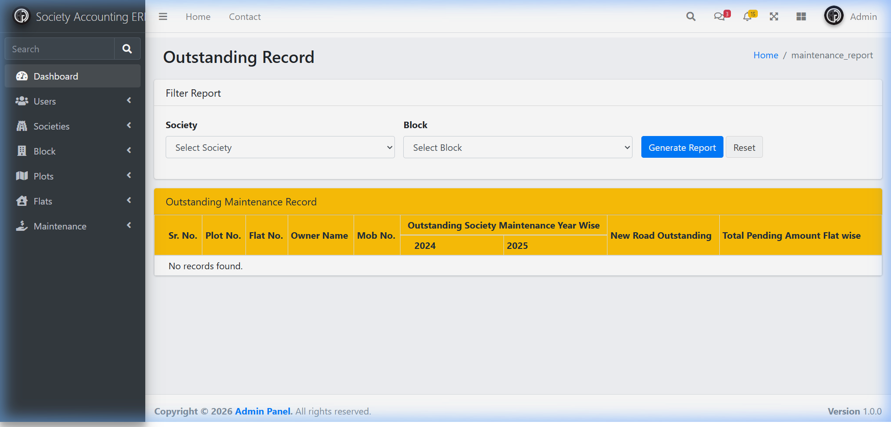

# Society Accounting Management System


## 🖼️ Screenshots

| Comprehensive ERP Dashboard | Society Management | Block Management |
| :---: | :---: | :---: |
|  |  |  |
| *Modern Dashboard UI* | *Society List View* | *Block Management View* |

| Plot Management | Flat Management | Maintenance Records |
| :---: | :---: | :---: |
|  |  |  |
| *Plot Tracking* | *Unit & Resident View* | *Billing & Payments* |

| Maintenance Reports (Grid) | Outstanding Report |
| :---: | :---: |
|  |  |
| *Financial Grid Overview* | *Defaulter Tracking* |

---

## 🚀 Overview

**Society Accounting Management System (SAMS)** is a highly scalable, multi-tenant SaaS-based Society ERP. Built with Domain-Driven Design (DDD) principles, it provides robust accounting, automated billing, and a seamless resident experience.

---

## ✨ Key Features (ERP Foundation)

✅ **Multi-Tenancy & Security**

- Shared schema isolation using `society_id` scope.
- Global `SocietyScope` with automated filtering.
- JWT/Sanctum based API authentication.

✅ **Professional Accounting Engine**

- Double-entry bookkeeping system (balanced journal entries).
- Dynamic Chart of Accounts tailored for Indian Societies.
- Automated generation of Trial Balance, Balance Sheet, and P&L.

✅ **Automated Billing & Recovery**

- Group-based charge generation (Maintenance, Sinking Fund, etc.).
- Recurring invoice generation with balance tracking.
- Automated late fee calculation and defaulter reports.

✅ **Society Infrastructure Management**

- Modular setup for Wings, Floors, Units, and Parking Slots.
- Comprehensive Member & Resident lifecycle management.
- Visitor management with OTP verification.

---

## 🛠️ Tech Stack

- **Backend:** Laravel 12.x (PHP 8.2+)
- **Database:** PostgreSQL (Core ERP) / MySQL (Legacy)
- **Frontend:** React + Tailwind CSS (V2) / AdminLTE (Legacy)
- **Cache/Queue:** Redis
- **Auth:** Sanctum / JWT

---

## 📦 Localhost Installation

1. **Clone the repository:**

   ```bash
   git clone https://github.com/aadhar41/society-services.git
   cd society-services
   ```

2. **Setup Dependencies:**

   ```bash
   composer install
   npm install
   ```

3. **Configure Environment:**
   - Copy `.env.example` to `.env`
   - Set legacy `DB_CONNECTION=mysql` or ERP `DB_CONNECTION=pgsql` (recommended).
   - Generate key: `php artisan key:generate`

4. **Initialize Database:**

   ```bash
   php artisan migrate:fresh --seed --seeder=DefaultChartOfAccountsSeeder
   ```

5. **Start Dev Server:**

   ```bash
   php artisan serve
   ```

---

## 🎯 Usage

### Basic Usage

#### Creating a Society

1. Navigate to the "Societies" section in the admin panel
2. Click "Add Record" to create a new society
3. Fill in the required details:
   - Name
   - Address
   - Contact information
   - Description
   - Location details (country, state, city)

```php
// Example of creating a society via API
$response = Http::post('/api/societies', [
    'name' => 'Green Acres Society',
    'address' => '123 Main Street, City',
    'contact' => '1234567890',
    'country' => 'Country ID',
    'state' => 'State ID',
    'city' => 'City ID',
    'description' => 'A beautiful residential complex'
]);
```

#### Managing Blocks

1. Select a society from the dropdown
2. Click "Add Record" to create a new block
3. Enter block details:
   - Name
   - Total flats
   - Description
   - Status

```php
// Example of creating a block via API
$response = Http::post('/api/societies/{society_id}/blocks', [
    'name' => 'Block A',
    'total_flats' => 50,
    'description' => 'Main residential block'
]);
```

#### Recording Maintenance Payments

1. Navigate to the "Maintenance" section
2. Select the appropriate flat
3. Enter maintenance details:
   - Type (monthly, lift, donation, etc.)
   - Date
   - Amount
   - Description
   - Attachments (if any)

```php
// Example of creating a maintenance record via API
$response = Http::post('/api/societies/{society_id}/blocks/{block_id}/flats/{flat_id}/maintenance', [
    'type' => 'monthly',
    'date' => '2023-05-15',
    'year' => 2023,
    'month' => 5,
    'amount' => 5000,
    'description' => 'Monthly maintenance charges',
    'attachments' => 'path/to/receipt.pdf'
]);
```

### Advanced Usage

#### Customizing the UI

1. Edit the SCSS files in `resources/sass/app.scss`
2. Modify the layout in `resources/views/layouts/app.blade.php`
3. Update the JavaScript logic in `resources/js/app.js`

#### Extending Functionality

1. Create new controllers and models following the existing pattern
2. Add new routes in `routes/web.php` and `routes/api.php`
3. Create new views in the `resources/views` directory
4. Add new migrations using `php artisan make:migration`

```bash
php artisan make:controller ComplaintController --api
```

#### API Integration

The system provides a comprehensive API for mobile applications and other integrations:

```php
// Example of API authentication
$response = Http::withHeaders([
    'Authorization' => 'Bearer ' . $token
])->get('/api/societies');
```

## 📁 Project Structure

```
society-accounting/
├── app/                  # Application source code
│   ├── Http/             # Controllers, Middleware, etc.
│   ├── Models/           # Eloquent models
│   ├── Providers/        # Service providers
│   ├── Repositories/     # Repository interfaces and implementations
│   └── ...
├── config/              # Configuration files
├── database/            # Database migrations and seeders
├── public/              # Publicly accessible files
├── resources/           # Views, languages, assets
│   ├── js/               # JavaScript files
│   ├── sass/            # SCSS stylesheets
│   └── views/           # Blade templates
├── routes/              # Route definitions
├── tests/               # Test cases
├── vendor/              # Composer dependencies
├── .env                 # Environment configuration
├── .gitignore           # Git ignore rules
├── artisan              # Laravel artisan CLI
├── composer.json        # PHP dependencies
├── package.json         # JavaScript dependencies
└── README.md            # This file
```

## 🔧 Configuration

### Environment Variables

Copy `.env.example` to `.env` and configure your environment:

```env
# Application settings
APP_NAME=Society Accounting
APP_ENV=local
APP_KEY=your-app-key
APP_DEBUG=true
APP_URL=http://localhost

# Database settings
DB_CONNECTION=mysql
DB_HOST=127.0.0.1
DB_PORT=3306
DB_DATABASE=your_database
DB_USERNAME=your_username
DB_PASSWORD=your_password

# Mail settings
MAIL_MAILER=smtp
MAIL_HOST=mailhog
MAIL_PORT=1025

# Caching
CACHE_DRIVER=file

# Session
SESSION_DRIVER=file
SESSION_LIFETIME=120

# Authentication
SANCTUM_STATEFUL_DOMAINS=localhost
```

### Customization Options

1. **Change the Admin Panel Theme:**
   Edit the `resources/sass/app.scss` file to customize colors and styles

2. **Modify User Roles and Permissions:**
   Update the `app/Policies` directory and adjust the middleware in `app/Http/Kernel.php`

3. **Add New Features:**
   Follow the existing pattern to add new models, controllers, and views

4. **Configure Payment Gateways:**
   Edit the payment-related configurations in the `config/services.php` file

## 📝 License

**PROPRIETARY SOFTWARE - ALL RIGHTS RESERVED**

This software and its source code are the exclusive property of **Aadhar Gaur**. 

- **NO UNAUTHORIZED USE:** No person or organization may use, copy, modify, or distribute this software without express written permission or a valid purchase agreement.
- **COMMERCIAL LICENSING:** For purchasing a license or commercial inquiries, contact: **aadhar.gaur@example.com**.

---

## 🎨 Design System

Our V2 architecture utilizes a premium design system with dynamic themes and sleek micro-animations for a high-end SaaS experience.

---

## 🤝 Contributing

This is a proprietary repository. Contributions are only accepted from authorized team members. See [CONTRIBUTING.md](CONTRIBUTING.md) for details.

---

## 👥 Authors & Contributors

- **Aadhar Gaur** ([@aadhar41](https://github.com/aadhar41)) - Lead Architect & Developer

---

## 🐛 Issues & Support

### Reporting Issues

If you encounter any problems or have feature requests, please:

1. **Check existing issues** to avoid duplicates
2. **Create a new issue** with:
    - Clear description of the problem
    - Steps to reproduce
    - Expected behavior
    - Your environment details
    - Any relevant error messages

### Getting Help

- **Community Support**: Join our [Discussion Forum](link-to-forum)
- **Official Documentation**: [https://your-docs-url.com](https://your-docs-url.com)
- **Email Support**: support@societyaccounting.com

### FAQ

**Q: How do I reset my password?**
A: Visit the `/forgot-password` route and follow the instructions sent to your email.

**Q: Can I use this system for commercial purposes?**
A: Yes, this system is licensed under the MIT License which allows for both personal and commercial use.

**Q: Does this system support multi-tenancy?**
A: Yes, each society can be considered a separate tenant with its own data.

**Q: Can I customize the UI?**
A: Absolutely! The system uses AdminLTE and SCSS, making it easy to customize the appearance.

## 🗺️ Roadmap (V2)

- [ ] Multi-Gateway Payment integration (Razorpay/Stripe)
- [ ] Mobile Resident App (Flutter/React Native)
- [ ] AI-driven Cashflow Forecasting
- [ ] IoT Integration for Smart Metering

---

## 🚀 Getting Started

Ready to get started with the Society Accounting Management System? Follow these steps:

1. **Install the system** as described above
2. **Set up your database** with the provided migrations
3. **Customize the system** to fit your specific needs
4. **Start managing your society** efficiently!

Join our community of users and developers to share experiences, ask questions, and contribute to the project's growth. Together, we can make society management easier and more efficient for everyone!

Thank you for choosing the **Society Accounting Management System**. We are committed to building the future of residential community management.
